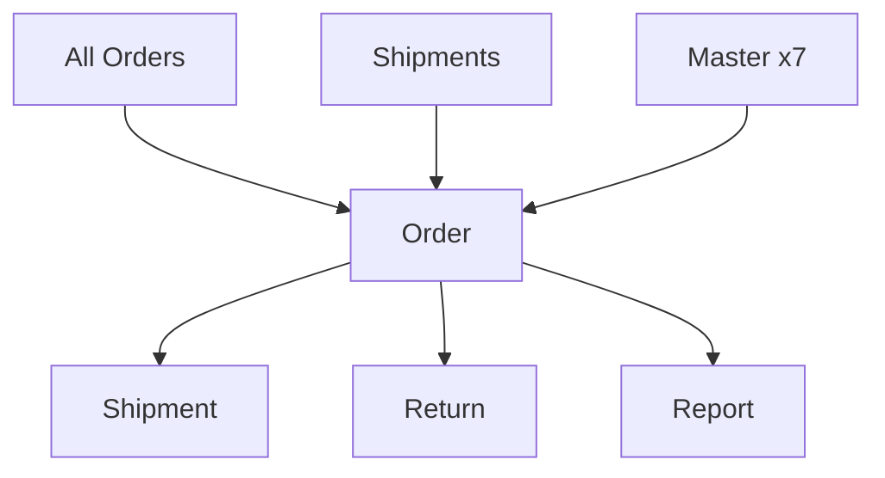

# Generate Canonical Schema

Create standardized canonical schema `.md` files where the schema table IS the lineage.
No duplication — every field's source is embedded inline using dot-notation.

## Inputs

| Input | Required | Description |
|-------|----------|-------------|
| Entity name | Yes | The canonical entity (e.g., `Order`, `Shipment`, `Return`) |
| Source material | Yes | Design doc, Excel file, BA spec, or user description of fields and sources |
| Existing schema | No | Existing `.md` to update — read first, then overwrite with new format |

## Output Path

```
BA/docs/schemas/canonical/{domain}/{entity-name}.md
```

## Workflow

### Step 1: Read Source Material

Read the input (design doc, Excel, or existing schema). Extract:
- All **header-level** and **line-level** fields
- Field groups (Identifiers, Dates, Status, Amounts, etc.)
- For each field: name, required flag, type, source mapping, description
- Business rules (BR1, BR2, ...) with affected fields
- Filters / exclusion rules
- Upstream data sources (raw APIs, fact tables, master tables)
- Downstream consumers

Use the `xleak` skill if the input is an Excel file.

### Step 2: Map Sources to Dot-Notation

Convert every field's source to the layered dot-notation format.

**Layer prefixes:**

| Prefix | Meaning | Example |
|--------|---------|---------|
| `raw` | Raw API/file ingestion | `raw.all_orders.purchase_date` |
| `fact` | Cleaned fact layer | `fact.all_orders_by_date.purchase_date` |
| `master` | Master data table | `master.t079.vat_registration_no` |
| `canonical` | Another canonical entity | `canonical.shipment.shipping_country` |
| `computed` | System-generated | `computed = Round(fact.all_orders.item_price / fact.all_orders.quantity, 2)` |

**Rules:**

1. **Use the final source** — reference `fact` if the canonical reads from fact, not raw.
2. **Multi-hop lookups** — reference the final table only: `master.t003.payment_terms`.
3. **Computed fields** — `computed = {formula}` with full dot-notation for ALL inputs:
   - `computed = "SO" + YYMM(fact.all_orders.purchase_date) + "-" + seq(master.t309)`
   - `computed = fact.all_orders.item_tax + fact.all_orders.shipping_tax + fact.all_orders.gift_wrap_tax`
   - `computed = "Order " + fact.all_orders.amazon_order_id`
4. **Direct mappings** — `fact.{dataset}.{column}` when 1:1.
5. **Transformations** — `computed = fact.all_orders.fulfillment_channel → "Amazon" = "FBA"; else "Others"`.
6. **Enum values** — list in the `Type` column: `enum(Shipped\|Pending\|Cancelled)`. If values are governed by a business rule, reference the BR ID in Description.

### Step 3: Generate Markdown

Write the schema file using this exact structure:

```markdown
# {Entity Name}

**Category:** {domain} | **Source:** `{source_file}` | **Design Doc:** [{link_text}]({path})

---

## Schema

> **Note:** {Entity description. Include: insert-only semantics, sync behavior,
> ID mapping conventions, Header/Line UI distinction if applicable.}

### Header-Level Fields

| # | Field | Required | Type | Source | Description |
|---|-------|----------|------|--------|-------------|
| **{Group}** | | | | | |
| 1 | `FIELD_NAME` | ✔ | `string` | `fact.dataset.column` | Description |

### Line-Level Fields

| # | Field | Required | Type | Source | Description |
|---|-------|----------|------|--------|-------------|
| **{Group}** | | | | | |
| 1 | `FIELD_NAME` | ✔ | `decimal(2)` | `computed = ...` | Description |

---

## Filters

| Rule | Description |
|------|-------------|
| {rule} | {description} |

---

## Business Rules

| ID | Rule | Description | Fields |
|----|------|-------------|--------|
| BR1 | {name} | {description} | `FIELD_A`, `FIELD_B` |

---

## Lineage

### Overview

{Minimal Mermaid flowchart TD — see Diagram Rules below}

### Downstream Consumers

| Consumer | Join Key | Usage |
|----------|----------|-------|
| [{Entity}]({entity}.md) | `JOIN_KEY` | {usage description} |
```

### Step 4: Verify Output

Confirm the file was created and report:
- Total field count (header + line)
- Number of business rules
- Output file path

## Schema Table Rules

**Columns:** `#`, `Field`, `Required`, `Type`, `Source`, `Description` — exactly these, in this order.

**Field names:** Always wrap in backticks: `` `ORDER_ID` ``, `` `LINE_TAX_AMOUNT` ``.

**Field numbering:** Sequential within each level. Restarts at 1 for Line-Level Fields.

**Group headers:** Bold separator rows (e.g., `| **Identifiers** | | | | | |`).

**Required:** `✔` for required, `—` for optional.

**Type values:**

| Type | When to use |
|------|------------|
| `string` | Text fields |
| `date` | Date fields (YYYY-MM-DD) |
| `datetime` | Timestamp fields |
| `integer` | Whole numbers |
| `decimal(N)` | Fixed precision (e.g., `decimal(2)` for amounts) |
| `enum(A\|B\|C)` | Enumerated values — list all allowed values |
| `boolean` | True/false flags |

**No other columns.** The former `Sample`, `Master Data`, and `Note` columns are removed.
`Master Data` is redundant with `master.tXXX` in Source. `Note` is merged into `Description`.

## Diagram Rules

Minimal Mermaid — flat `flowchart TD`, no subgraphs, short labels.

1. **No subgraphs** — flat layout only
2. **Short labels** — max 2-3 words per node
3. **Master data as single node** — `Master x{N}` with count
4. **Pending/future links** — dotted arrows: `A -.-> B`
5. **Max 10 nodes** — split if more
6. **Direction** — always `TD` (top-down, for TUI rendering)

Example:



## Common Mistakes

| Mistake | Fix |
|---------|-----|
| Using `VARCHAR`, `DECIMAL(18,2)` | Use `string`, `decimal(2)` |
| Separate Source-to-Field Mapping section | Source is inline in the schema table |
| Verbose source like `Master data lookup: table.col` | Just `master.t027.item_name` |
| Computed formula without full paths | `computed = fact.all_orders.item_price / fact.all_orders.quantity` not `item_price / quantity` |
| `flowchart LR` or subgraphs in diagram | Always `flowchart TD`, flat, no subgraphs |
| Adding Sample, Master Data, Note columns | Only 6 columns: #, Field, Required, Type, Source, Description |
| Numbering continues across Header→Line | Numbering restarts at 1 for each level |
| Field names without backticks | Always wrap: `` `FIELD_NAME` `` in Field column |
| Filters as bullet list | Always use a table: `\| Rule \| Description \|` |
| Business Rules missing ID column | Must have 4 columns: `ID`, `Rule`, `Description`, `Fields` |
| Downstream table wrong column names | Must be: `Consumer`, `Join Key`, `Usage` — not `Purpose` |
| Diagram labels too long (`fact.fba_returns`) | Use short names: `FBA Returns`, `Refund Events` |
