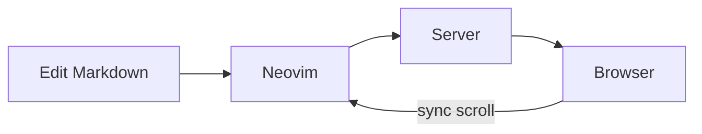
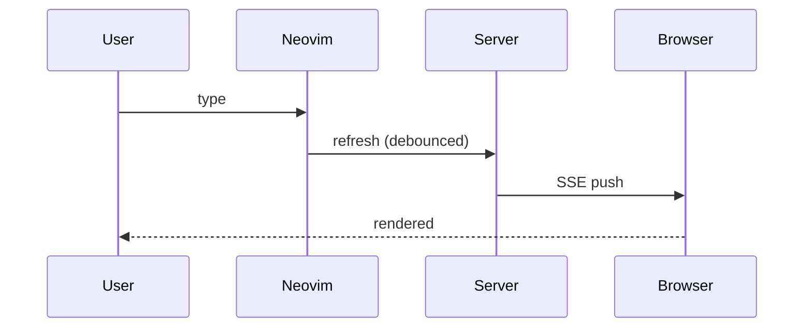
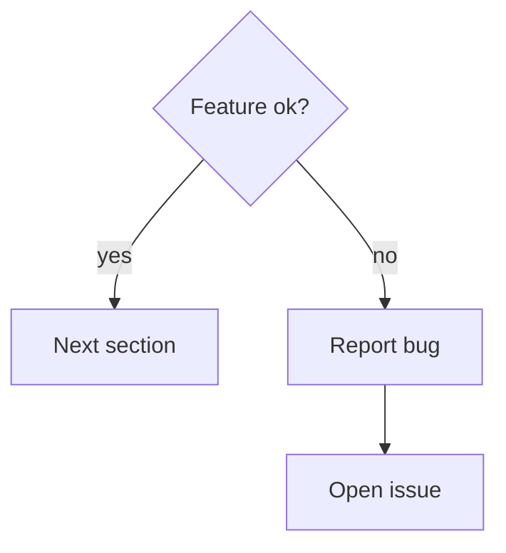
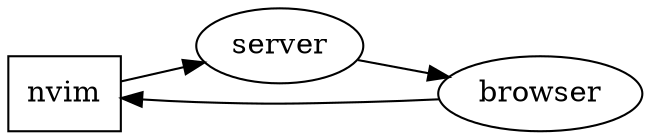
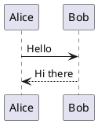

<!-- toc -->

# Markdown Preview Feature Test

Exercise every feature the preview server supports. Scroll down — the browser
should follow your cursor (sync scroll, mode: middle).

## Text & Typography

This is **bold**, *italic*, ***bold italic***, ~~strikethrough~~,
`inline code`, and [a link](https://neovim.io) with [an image after](#tables) it.
Here is an emoji: 👋 🚀 ✅ 🔥

> A blockquote.
> It can span multiple lines.
> > And nest.

Second paragraph — spacing between paragraphs should be preserved.

### Footnotes

Here is a claim with a footnote.[^1] And another one.[^2]

[^1]: First footnote text.
[^2]: Second footnote text, longer than the first one to check wrapping.

### Definition List

Dog
: Barking animal, domesticated from the wolf.

Cat
: Independent animal, professional napper.

## Lists

1. Ordered item one
2. Ordered item two
   - Nested unordered
   - Another nested
3. Back to ordered

- Unordered A
- Unordered B
  1. Nested ordered inside unordered
- Unordered C

### Task List

- [x] Install sammaji/markdown-preview.nvim
- [x] Swap out live-preview.nvim
- [ ] Confirm live updates as you type
- [ ] Confirm sync scroll
- [ ] Check math rendering

## Code

```lua
-- lua block with highlighting
local M = {}

function M.greet(name)
  -- say hello
  local msg = string.format("hello, %s!", name)
  return msg:upper()
end

return M
```

```python
def fib(n: int) -> int:
    a, b = 0, 1
    for _ in range(n):
        a, b = b, a + b
    return a
```

```
plain block with no language (should render as plain pre)
```

Indented code (4 spaces):

    legacy indented code block

## Tables

| Left   | Center | Right  |
|:-------|:------:|-------:|
| l1     |   c1   |     r1 |
| l2     |   c2   |     r2 |
| long cell content that should wrap | c3 | r3 |

## Math (KaTeX)

Inline math: $E = mc^2$ and $\alpha + \beta = \gamma$.

Display math:

$$
\int_{-\infty}^{\infty} e^{-x^2}\,dx = \sqrt{\pi}
$$

$$
\begin{equation}
\hat{H}\,\psi = E\,\psi
\end{equation}
$$

Chemistry (mhchem):

$$
\ce{2H2 + O2 -> 2H2O}
$$

$$
\ce{Na+ + Cl- -> NaCl}
$$

## Mermaid







## Graphviz (dot)



## PlantUML



## Flowchart (flowchart.js)

```flow
st=>start: Start
op=>operation: Refresh
e=>end
st->op->e
```

## Sequence diagram (js-sequence-diagrams)

```sequence
Editor->Server: buffer change
Server->Browser: reload
Browser->Editor: scroll sync
```

## Chart.js

```chartjs
{
  "type": "bar",
  "data": {
    "labels": ["live-preview", "sammaji-fork", "selimacerbas"],
    "datasets": [{
      "label": "features",
      "data": [2, 9, 8],
      "backgroundColor": ["#ea76cb", "#50fa7b", "#8be9fd"]
    }]
  },
  "options": { "plugins": { "title": { "display": true, "text": "feature count (rough)" } } }
}
```

## Local Images


(put a `logo.png` next to this file to test both; first renders full-size,
second constrained to 200x60)

## YAML front matter

The front matter block at the top of this file should be **hidden** in the
preview (`hide_yaml_meta = 1` by default).

---

*If everything above renders, the plugin is working. Try `:MarkdownPreviewStop`
and `:MarkdownPreviewToggle` (<leader>mp) to check lifecycle.*